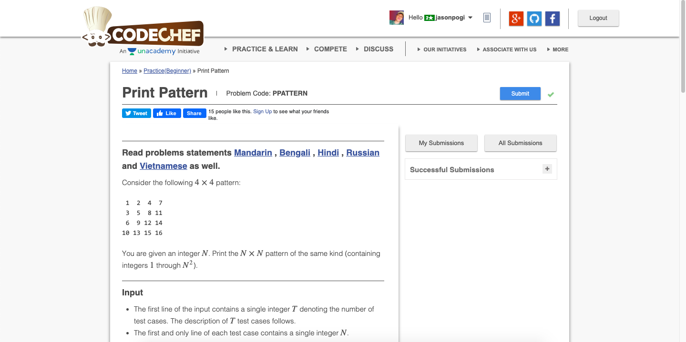

# Codechef-Print-Pattern
Problem

## Program Simulation
<pre>

    int cur = 1
    
		for (int i = 0; i < n; i++) {
			for (int j = 0, k = i; k >= 0; j++, k--) {
				a[j][k] = cur++;
			}
		}
    
		// a[0][0] = 1
		// a[0][1] = 2
		// a[1][0] = 3
		// a[0][2] = 4
		// a[1][1] = 5
		// a[2][0] = 6
		// a[0][3] = 7
		// a[1][2] = 8
		// a[2][1] = 9
		// a[3][0] = 10
    
		for (int i = 1; i < n; i++) {
			for (int j = i, k = n - 1; j < n; j++, k--) {
				a[j][k] = cur++;
			}
		}
    
		// a[1][3] = 11
		// a[2][2] = 12
		// a[3][1] = 13
		// a[2][3] = 14
		// a[3][2] = 15
		// a[3][3] = 16
    
</pre>
